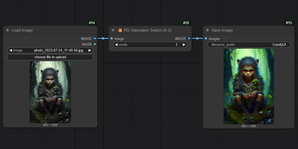

# 🦊 RS Safe Saturation Node for ComfyUI

Профессиональный контроль насыщенности изображения с защитой от артефактов и пересветов.



## 🔥 Особенности

- **Плавное регулирование** с шагом 0.05
- **Интеллектуальное усиление** без пересветов
- **Защита от артефактов** даже на экстремальных значениях
- **Оптимизировано** для работы с batch-изображениями
- **Поддержка** Windows/Linux, Python 3.11+, PyTorch 2.0+

## 🛠 Установка

Доступна установка через Менеджер ComfyUI
или
используйте команду git clone https://github.com/Raykosan/RaykoStudio-SaturationNode/` из папки custom_nodes
или
Скопируйте папку `RaykoStudio_Nodes` в ComfyUI/custom_nodes/. Перезапустите ComfyUI

## 🎛 Использование

```
[ 🦊 RS Safe Saturation ]
├── Image: [Подключите изображение]
├── Intensity: 1.0 (0.0-3.0)
│   ├── 0.0 = Полное обесцвечивание
│   ├── 1.0 = Оригинальная насыщенность
│   ├── 1.5 = Безопасное усиление
│   └── 3.0 = Максимальная насыщенность (с защитой)
└── Output: [Обработанное изображение]
```

## ⚙️ Технические детали

### Алгоритм работы:
1. Конвертация в luminance-пространство
2. Нелинейное изменение насыщенности:
   - Для значений <1.0 - линейная интерполяция
   - Для значений >1.0 - адаптивное усиление с S-образной кривой
3. Автоматическая коррекция пересветов

### Рекомендуемые значения:
- **0.0-0.9**: Тонирование/уменьшение насыщенности
- **1.0-1.3**: Естественное усиление (рекомендуется)
- **1.3-2.0**: Яркие цвета для художественных эффектов
- **2.0-3.0**: Максимальная насыщенность (для спецэффектов)

## 📜 Лицензия
MIT License. Используйте свободно в коммерческих и некоммерческих проектах.

## 🤝 Поддержка
Нашли баг или есть предложения?  
[Создайте issue на GitHub](https://github.com/Raykosan/RaykoStudio-SaturationNode/issues)

---

> "Лучшая насыщенность - та, которую не видно" © RaykoStudio 2024
